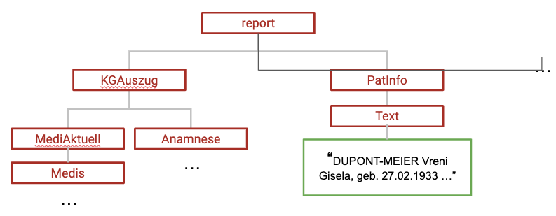

## Annotation Pipeline Components and theirs Configurations

The deidentification tool was designed to be relatively flexible to accommodate
various needs.

## Data Input

More details on the configuration of the report input data source.

### DB Configuration
<a id="db_config"/>

Configuration parameters to load reports from a database are stored in a text
file (properties file) with the following attributes ([example config](installation.md#db_config_example)):

* `jdbc_url`: the URL to connect to the database, [see also](https://docs.oracle.com/javase/tutorial/jdbc/basics/connecting.html)
* `user`: the database user name
* `password`: the password
* `query`: a "SELECT" SQL query. Can be anything (e.g. joining data from several tables, a view ...) as long as certain columns are present
* `json_field_name`: the column name in the above SQL query denoting the JSON content of a report
* `reportid_field_name`: the column name denoting the reportid of a report in the
  SQL query
* `report_type_id`: the column name in the above query denoting the report type
  ("FCODE") of a report. This is mainly used to select certain types of reports.
* `date_field_name`: the column name in the above query denoting the creation date
  of a report (optional).

In case reports should be written back to a database after substitution:
* `dest_table`: table name to write into
* `dest_columns`: the names of the columns to write back. These should be a
  subset of the columns in the above SELECT SQL query (could also be all of them)


#### Report Filtering

##### Document Type Filter

Depending on the project, only certain document types ("FCODE") might be
relevant. These could be filtered out in the SQL query or also using a simple
text file which can be passed to the `annotate` or `import` command using the
`--doc-type-filter` option.

The file contains one row per document type and at least one column (seperated by ','), where the first column denotes
the document type name. There can be more columns (for example human readable description), which are ignored by the application.


##### Document ID Filter

Similar to document type filters, one can specify to load only documents having
a specific ID. This can be done by passing a file path using the
`--doc-id-filter` option.

Columns:
* report id


## Annotation Pipeline

Quite a few aspects of the annotation pipeline can be parameterized.
In this section, more details about various annotation steps and their configuration.

### Pipeline Configuration File

Many pipeline steps can be parametrized by specific configuration files or other parameters. The parametrization happens via a
configuration file setting all relevant parameters for the annotation pipeline. You can pass the path of the file to the
`annotate` command using `-c`. The syntax of the file follows the [HOCON format](https://github.com/lightbend/config), see the
[configuration of the USZ pipeline as example](/configs/kisim-usz/kisim_usz.conf)

Configurations relevant to the pipeline are grouped together into the `pipeline` 'section'.

### Lexica (Dictionaries, Gazetteers)

The `pipeline.gazetteer` option should point to a GATE gazetteer file
definition (`*.def`). This text file contains an entry for each dictionary file
with the (relative) path and the annotation type. A dictionary file is simply a
text file with one or more token per line. More details in the [GATE
Documentation](https://gate.ac.uk/sale/tao/splitch6.html#x9-1270006.3)

The annotation pipeline also uses a second category of gazetteers specified in
`pipeline.suffixGazeteer` not matching entire tokens but suffixes.
This is useful for rules based on word endings, for example to recognize
surnames ("-mann", "-oulos", "-elli") and medical terms ("-karzinom",
"-suffizienz", "-beschwerden").


### Specific JAPE Rules

There is a generic set of JAPE rules shipped with the application. Typically,
these rules cannot cover special cases appearing in a given organization. This
can be done using a separate rule set.

Specific rules can be added via the `pipeline.specificTransducer` option
pointing to a `*.jape` file. This file would contain a list of different phases,
where every phase is a separate `*.jape` file. These files would then contain
the actual JAPE rules. See also the [Gate
Documentation](https://gate.ac.uk/sale/tao/splitch8.html#x12-2310008.5).


### Report Structure

If available, the structure of input documents can be exploited during
the annotation (and in principle also during substitution). That is, prior
knowledge about the document can be added.

In case of JSON, the
structure elements would be field names and nested objects. A JSON document can
then be seen as a tree where the leaves contain the actual report text fragments.




#### Paths in Field Tree

In the various configuration files related to annotations, paths in the
"field tree" can be used to denote certain parts of the document (similar to
XPath for XML documents).

A **path** can consist of the following elements:
 * field name: can be a [regular expression accepted by Java](https://docs.oracle.com/javase/8/docs/api/java/util/regex/Pattern.html)
 * '/' denoting that the nodes must appear consecutively, e.g. `field_a/field_c`
   matches only "field_a/field_c" but not "field_a/field_b/field_c" .
 * '//' denoting that the nodes don't need to be necessarily consecutive, e.g.
   `field_a/field_c` would match both "field_a/field_c" and
   "field_a/field_b/field_c"

Note, that paths are case-sensitive.

Examples:
 * Simple field names which can appear anywhere in the tree:
   * `Id`
   * `ID`
   * some regular expression `[\\p{IsAlphabetic}]*VisDat` ("\p" is used to match unicode characters).
 * Field names with some constraints regarding the parent. For instance, to match `Text` fields only when it is a child of `PatInfo`, you
   can use `//PatInfo//Text`, which would match e.g. "/report/PatInfo/some_element/Text"
 * Field constraints "anchored" from the top: `/NOTE` would match a field "NOTE" directly
   under the root of a tree, but not "/PatientInfo/NOTE".


#### Structured Annotations

The "structured annotation step" allows annotating entire text fields.
For instance, if you know that a certain field contains the name
of a person, then an annotation can be performed at that level.

This step can be parametrized with a configuration file passed in `pipeline.structuredFieldMapping` in the pipeline configuration.

Columns in the config file (separated by ";"):
 * Path
 * Annotation type (e.g. `Name`, `Date` etc)
 * Features (properties) of the annotation . Features are separated by "," where
   key and values are separated by "="

Example: `//Personalien//Name; Name; type=patient`

All leaves with `Name` having `Personalien` as a parent somewhere are annotated
with `Name` and having the `type` property set to `patient`.


#### Field Normalization (Field Annotation Mapping)

Sometimes, we can not blindly annotate an entire field, but need to
apply a JAPE rule on it. For example, signatures could have a structure like
"ABCD, 20.10.2018" where "ABCD" is the shorthand for a doctor. Since there are
many fields with similar or identical structure, but different paths
the fields can get renamed to a common name. A JAPE rule processing the pattern
would then refer to that common name.

This step can be parametrized with a configuration file passed in `pipeline.annotationMapping` in the pipeline configuration.
Columns (separated by ";"):
  * Path
  * New field name

Example: `//Patient/Alter/Val; AgeField`

A field `Val` with immediate ancestors `Alter` and `Patient` gets named an
`AgeField`. Now a JAPE rule only working on `AgeField`s, could for example
annotate any number in there as an age.

#### Annotation Blacklist

For some fields we can exclude a priori certain annotations. An example could be
a field containing computer generated identifiers like
`9b02d92c-c16e-4d71-2019-280237bb8cb5` where a JAPE rule may erroneously pick up
a date (for example "2019" in the example). A blacklisting step would remove such annotations.


This step can be parametrized with a configuration file passed in `pipeline.annotationBlacklist` in the pipeline configuration.

Columns (seperated by ";"):
  * Path
  * Comma separated annotation types which should *not* appear within elements
    denoted in path

Example:
`//DiagnList//CodeList//Version; Date`

The `Version` field having `CodeList` and `DiagnList` as parents should not
contain `Date` annotations.

### Context Annotations

There are some JAPE rules which only get triggered if tokens appear in a specific language context. This can
be useful to disambiguate between e.g. surnames and professions or between the
profession of a patient vs the role of staff.

The context can be given by a field (using [Annotation Mappings](#annotation-mapping)) or by using **context
annotations**. They can be added around trigger tokens. For instance, text in the vicinity of `Sohn`
(son) may contain his name or information about his profession. Therefore,
`NameContext` and `OccupationContext` context annotations are added to the document,
spanning the e.g. 5 tokens before `Sohn` and 5 tokens after. Later on, if within
these context annotations e.g. an isolated first name appears, it can be
annotated as `Name` since we assume it is a context where names can occur
(otherwise we wouldn't annotate it, as there is not enough evidence).
Context annotations are performed in early stages of the pipeline,
s.t. they can be referred to in JAPE rules later on.

These context triggers can be configured in a config file whose path has to be provided
in `pipeline.contextTriggerConfig` in the pipeline configuration.

Columns (separated by ";"):
  * Context token (no spaces)
  * Name of the context (e.g. `NameContext`)
  * start of the context annotation in number of tokens before the trigger token
  * end of the context annotation in number of tokens after the trigger token


Examples:
* `Sohn;NameContext;5;5`
* `Partner;OccupationContext;5;5`


## Test Suite

A small testing framework was developed to test the annotation behavior of the
pipeline in a fast and isolated way. That is, small test cases can be defined consisting
of a phrase and the annotations the pipeline is expected to produce.
This allows for test driven development/tuning of the annotation pipeline.

### Test Cases Specification
The testcases are described in a textfile. The first line of the text file
contains the annotation types the pipeline is tested against as well as the
context fields. The context fields annotations are used to test rules based on the document structure.
The lists for annotation types and context fields are seperated by `;` and the
entries in lists by `,`.

Then testcases follow, one per line. Manual annotations and fields are added using XML-tags.
Comments using '#' are allowed either to comment entire lines are the remainder
of a line. Commented parts are ignored. There may be empty lines for making the
file a bit more readable. If new lines are needed to test a specific situation,
this can simply be done using `\n`.

Following an example with 3 test cases:
```
Name; FieldWithSignature

Der Patient <Name>Luigi D'Ambrosio</Name> wurde...

<FieldWithSignature>20.01.2018 / <Name>AMUSTER</Name> </FieldWithSignature>
20.01.2018 / AMUSTER # don't expect name annotation in arbitrary fields
```

In this example, the annotation of `Name` is tested. The `<Name>` tags are
removed before the test case is passed through the pipeline. Then, the `Name`
annotations of the pipeline output are checked whether they indeed contain `Name`
annotations at the same place, and only there. If this is the case, the test
passes, otherwise it fails with an appropriate message.

The second test case tests a context specific rule, i.e. the rule is only
applied within fields `FieldWithSignature` (In the USZ pipeline,
`FieldWithSignature` annotation is added the annotation mapping step, see above)
The third test case is just to see, if the previous rule is not triggered
outside the required context. Or said differently, we expect `AMUSTER` not to be
annotated, i.e. annotating it would be wrong.

In some existing tests there is also the `OUTOFVOC` token. It stands for
"out of vocabulary" and makes it explicit, that the rule should rely exclusively on structure,
and not be based on entries in the dictionary.

##### Running Tests

A test suite can be run using the `test` command from the `DeidMain` entry
point:

```
$DEID_CMD test [pipeline configuration file] [testcase directory]
```

It commands needs a path to a pipeline configuration file (e.g. `configs/kisim-usz/kisim_usz.conf`) and
a directory with testcases (e.g. `configs/kisim-usz/testcases/`). Every `*.txt` in that directory is assumed to contain test cases.

The generic rules shipped with the tool are tested using the same mechanism.
They are run as unit tests for the tool itself.
The test cases can be found in the directory `deidentifier-pipeline/src/test/resources/pipeline_testcases`
You normally don't need to modify these tests while tuning the pipeline, but you may consider them a source
of useful examples.
