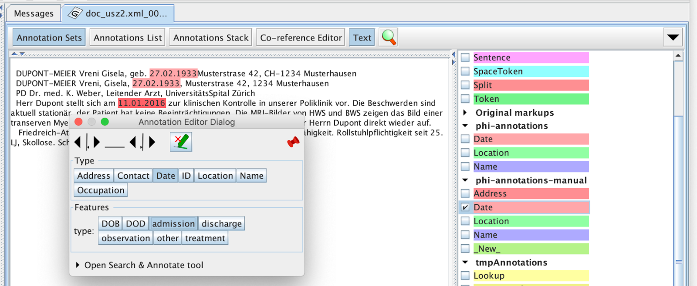

## Evaluation Guide

We sketch how to evaluate the performance of the pipeline on your reports.

### Create Goldstandard Set

One approach is to annotate relevant reports using the existing pipeline (using the `annotate` command) and let experts check/complement
the resulting annotations. Alternatively, you can simply convert the reports to the GATE internal format using the `import` command.
In this case, the annotator would have to create all annotations manually, which can be very tedious.

#### Annotation Guide

First, install [GATE Developer](https://gate.ac.uk/download/).

If you haven’t already, load the `Schema Annotation Editor` via `File` -> `Manage CREOLE Plugins`.
Tick `Load now` and `Load always` next to `Schema Annotation Editor`. Restart GATE

Load a schema into GATE: right click on `Language Resources` in the explorer view, choose `New` -> `Annotation Schema`.
Click on the briefcase symbol on look for the [master.xml](/deidentifier-pipeline/src/main/resources/schemas/master.xml) file on your filesytem .
Open a GATE document, activate `Annotation Sets` view and select the phi-annotations-manual annotation set on the right.

Make sure, schemas are loaded in GATE before you open a corpus to annotate. Load the corpus via `File` -> `Datastores` -> `Open Datastore`.
Load document and add necessary annotations by marking some tokens and pressing `Ctrl+E`
When creating a new annotation, make sure `phi-annotations` is selected on the right hand side.
Regularly do Right-click on document then `Save to its datastore` (not done automatically!)

Also make sure reports are read-only to not accidentally edit the document:

### Evaluate with Respect to Goldstandard Set

To compare the pipeline output to the goldstandard corpus, annotate the same reports using the `annotate` comman, but
this time add the `-m` option with the path to the goldstandard corpus (`m` for "marked"). You can also add the option
`--diagnostics-dir` with path where diagnostics information should be output. It will contain a performance summary in `corpus-stats.html`
as well detailed output for every report.

#### Analyse Results in More Details

With the `--diagnostics-dir` option, various "features" of every token are extracted and stored in json files in the `ml-features.json`. These features
include the annotations of the pipeline and the rule generating the annotation as well as the annotations from the goldstandard (if available). They also include in what lexica
a token was found, in what field the token appeared, the position within the sentence.

These json file(s) can be converted to parquet using a [python script](/scripts/convert_ml_features_to_parquet.py) and then explored
in a jupyter notebook. This is very helpful to get an overview over problems in one or several corpora.
