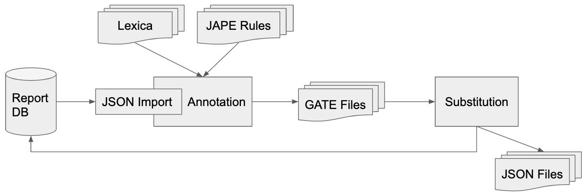

# Overview and Scope

The deidentification tool consists of a collection of command line applications written in Java.
The applications is based on the [GATE framework](https://gate.ac.uk/)

Here, a short overview over each command line application. Each square box
represents a different command described in the following sections.




## import

The `import` command imports reports typically from a database, converts them to
a GATE compatible representation and stores a batch of documents into a GATE
corpus (which is a directory on a filesystem).

It is assumed that the documents are stored in a database table or view, one row
per document. The actual report content is encoded as JSON string in one of the columns. Other
required columns denote the document type (`FCODE`) as well as the report id. 

The tree like structure of the JSON documents is preserved during the conversion
to the GATE compatible representation . This can be exploited during the
annotation.

## annotate

The `annotate` command takes documents from a GATE corpus and runs an annotation
pipeline over the reports, i.e. annotates portions of the text which contain
entities to be deidentified. The output of this process is again a GATE corpus,
which can be examined e.g. using the [GATE developer tool](https://gate.ac.uk/download/).

An *annotation* simply denotes a span of text with some properties associated, for
example: "Mr. Muster, born 01.01.1964 in Aarau" could have 3 annotations related
to deidentification: one for 'Muster' (Name), another for '01.01.1964' (Date,
with the additional information that it is a birthdate) and 'Aarau' (Location).

The annotation pipeline consists of basically of the following consecutive steps:
* **Tokenization**: splitting the text into units of characters ('words'), for
  example 'Mr. Muster' would be split into 3 tokens 'Mr', '.' and 'Muster'
* **Sentence Splitting*: Grouping consecutive tokens together into sentences
* **Lookups*: Annotating tokens using dictionaries ("Gazetteers"). For instance, the tokens
  'Universitätsspital Zürich' could be annotated as "organsation" and the token
  "Zürich" as "location"
* **Structured Annotation*: annotate entire fields known to consist of
  information to be deidentified. For example the content of a field `Tel` denoting a phone
  number could immediately be annotated without having to apply any further processing.
* **JAPE rules*: annotate tokens which need to be deidentified. This is based on
  the structure or content of tokens (e.g. a specific trigger word such as "Dr"
  or being a number) as well as  previous annotations from dictionaries from the
  previous step. Note, that rules can also exploit the tree-like structure of
  the document, for example a rule may only apply if the token in a field is
  part of the section of the document related to patient information.
* **Clean up*: resolve overlapping or conflicting annotations.

Currently, the following entities are annotated:
* Age
* Address
* Contact (distinguishing phone numbers, email and websites)
* Date (if possible determining birth date, admission date, discharge date)
* ID (patient or case ID, social security or insurance numbers)  
* Name (if possible distinguishing patient from staff)
* Location (broad category containing geographical locations as well as
  organizations)
* Occupation

The implementation can effectively exploit the presence of several CPU cores to speed up the
annotation process by annotating documents in parallel. 

### JAPE Example

Here an example of a JAPE rule. We are interested in recognizing ages in a very
specific pattern, namely the age followed by "jährige", "jähriger" or
"jährigen", e.g. "59-jähriger Patient":

```
// 0-119 (including decimals)
Macro: POSSIBLE_AGE
(
    ({Token.string ==~ "[1-9]*[0-9]"} | {Token.string ==~ "1[0-1][0-9]"})
    ({Token.string == "."} {Token.string ==~ "[0-9]+"})?
)


Rule: AgeRightContextTrigger
(
   (POSSIBLE_AGE):age
   ({Token.string == "-"})?
   ({Token.string ==~ "jährige[rn]?"})
)
-->
:age.Age = {rule = "AgeRightContextTrigger"}

```

Rules describe a sequence of tokens on the "left hand side", i.e. before "-->". If such a sequence is recognized in a text
a rule is triggered and the "right hand side" is applied. In the above case, the
right hand side adds an annotation of type `Age` having as a property the name
of the rule triggered (this helps debugging).

A token can be described exactly, like `{Token.string == "-"}` where the token
should consist exactly of `-` or using regular expressions as in `{Token.string
==~ "1[0-1][0-9]"}` describing the numbers from 100 to 119. A sequence of tokens
may contain optional elements denoted with `?`. In the above example the
`({Token.string == "-"})?` signifies, that there may or may not be a dash.

More details regarding JAPE can be found in the [JAPE Grammar
Tutorial](https://gate.ac.uk/sale/thakker-jape-tutorial/GATE%20JAPE%20manual.pdf)

Note, that the above example is not robust against typos, e.g. the rule would
fail to annotate the age in "59-järiger Patient".


## substitute

Takes an annotated GATE corpus and generates a JSON representation of the
content with to be deidentified tokens replaced. The JSON version of these reports can
then be saved back to a database table or to JSON files on a drive one per
report.

### Substitution Policies

There are several policies implemented on how annotated tokens should be
replaced:

* `ScrubberSubstitution`: entities are replaced by a fixed string depending on
  the annotation type, for example 'am 01.02.2003' would be replaced as "am
  DATE" and 'Dr. Muster' by 'Dr. NAME'
* `DateShift`: same as `ScrubberSubstitution`, but all dates of a report are shifted by a
  random amount of days into the future or past.
* `ReplacementTags`:  In this policy information are passed along to a
  downstream application which takes care of the actual deidentification. For
  that purpose entities are replaced by 'tags' which contain as much information as
  possible from the annotation pipeline. For example a text like "Dr. P. Muster empfiehlt"
  could be replaced by 
  `Dr. [[[Name;P. Muster;firstname=P;lastname=Muster;type=medical staff]]] empfiehlt`
  that is, the original value is preserved and the downstream application can
  decide how to replace the name most appropriately.
  
There exist also an option, where a list of field names can be provided which
are completely erased from the document. This can be useful for fields with are
notoriously hard to deidentify but contain no relevant information for
a downstream application. 
